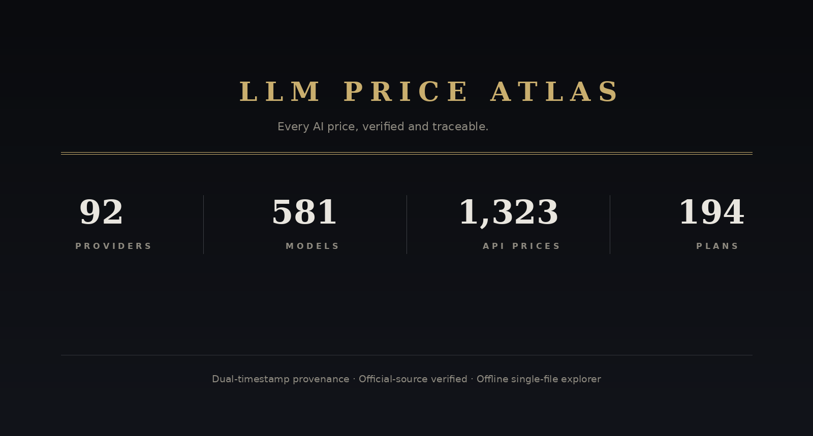

<div align="center">



**Every AI price, verified and traceable.**

[Open Live Explorer](https://moyu-good.github.io/llm-price-atlas/) · [中文文档](README.zh-CN.md) · [Verification Report](data/verify_report_2026-08-22.md) · [License](LICENSE)

</div>

---

A single SQLite database covering **token pricing, subscription plans, plan-to-model mappings and API endpoint metadata** across 92 providers — DeepSeek, Zhipu, Moonshot Kimi, MiniMax, Doubao, Qwen, OpenAI, Anthropic, Google, xAI, OpenRouter, Groq and more.

Every row carries dual timestamps (`collected_at` + `effective_at`), every plan links its official source, and every correction keeps its original value for audit.

## The database

| Table | Rows | Content |
|---|---|---|
| `platforms` | 92 | Providers + API triplet (docs URL / base URL / compatibility) |
| `models` | 581 | Model catalog with context windows |
| `pricing` | 1,323 | Per-token prices — input / output / cache-hit, USD + CNY |
| `plans` | 194 | Subscriptions — price, quota, **models included**, official source |

## Explore online

The repo ships a zero-dependency single-file app — [`index.html`](index.html) — with the dataset embedded. Four views: cross-provider **price comparison**, raw price table, subscription plans with model matrices, and API endpoint cards. Works offline; deploy anywhere by pushing one file.

## Quick start

```sql
-- cheapest input+output text models right now
SELECT model_name, platform,
       SUM(CASE WHEN item_type LIKE '输入%' THEN price_usd END) AS in_$,
       SUM(CASE WHEN item_type = '输出'    THEN price_usd END) AS out_$
FROM pricing WHERE price_usd > 0
GROUP BY platform, model_name
HAVING in_$ IS NOT NULL AND out_$ IS NOT NULL
ORDER BY in_$ + out_$ LIMIT 10;
```

Rebuild everything from the database: `python scripts/build.py`

## Methodology

| Layer | Technique | Coverage |
|---|---|---|
| Full diff | OpenRouter live API, row-by-row compare | 1,033 rows |
| Official pages | Firecrawl-rendered JS + manual verification | Anthropic, OpenAI, DeepSeek, xAI, Google, ElevenLabs, Kimi, Zhipu, Trae, Windsurf… |
| Source hygiene | Every plan carries an official URL; weak sources purged | 194 / 194 |

<details>
<summary><b>Changelog</b></summary>

| Date | Notes |
|---|---|
| 2026-08-22 | Full verification round — prices 1,278 → 1,323; plans 178 → 194 with 100% sourced; API endpoint triplets added for 21 platforms; fixed 9 data defects (phantom Opus 4.7 Fast tier, ElevenLabs Creator halved to $11, Trae currency mix-up…) |
| 2026-08-17 | Initial snapshot — 84 platforms / 571 models / 1,266 prices / 164 plans |

</details>

<details>
<summary><b>Disclaimer</b></summary>

This is a verified snapshot, not a live feed — check `effective_at` before relying on any price. CNY values use a fixed FX rate of 7.1 (`fx_rate` column kept per row); actual billing follows each provider's currency. Peak/off-peak fields are defined only within DeepSeek's official system.

</details>

## License

[MIT](LICENSE)
